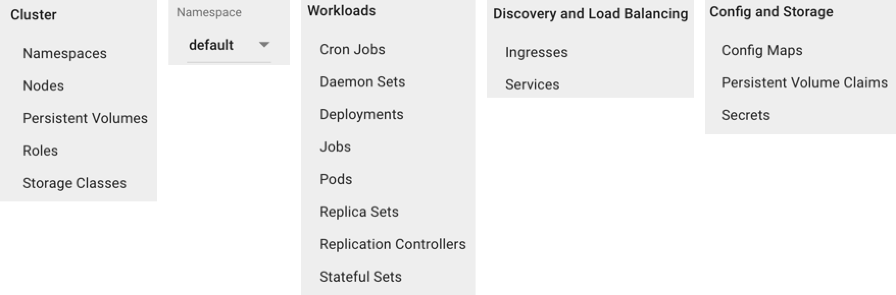

# Day One - Exploring Your Cluster

---

Now that we have created our first cluster it's time to explore it.

---


## Dashboard

We quickly touched on the dashboard in the previous section.  Now we will explore it in more detail.

```console
minikube dashboard
```

The image below shows the elements of the dashboard navigation sidebar.



**Cluster**

This is where the cluster scoped items can be found.

| Item          |
|:--------------|
| [_Namespaces_](https://kubernetes.io/docs/concepts/overview/working-with-objects/namespaces/) |
| [_Nodes_](https://kubernetes.io/docs/concepts/architecture/nodes/) |
| [_Persistent Volumes_](https://kubernetes.io/docs/concepts/storage/persistent-volumes/) |
| [_Roles_](https://kubernetes.io/blog/2017/04/rbac-support-in-kubernetes/) |
| [_Storage Classes_](https://kubernetes.io/docs/concepts/storage/storage-classes/) |

**Namespace**

This drop-down list box allows you to select a specific _Namespace_ to work with.  The resources available from the following navigation panes will be scoped to the selected _Namespace_.

**Workloads**

The fundamental unit of execution is known as a [_Pod_](https://kubernetes.io/docs/concepts/workloads/pods/pod-overview/).  A _Pod_ has one or more _Containers_.  _Pods_ are generally not managed directly by the user.  Instead a workload controller is used to manage _Pods_ in a way that makes sense for the differring needs of an application.

| Controller       | 
|:-----------------|
| [_CronJob_](https://kubernetes.io/docs/concepts/workloads/controllers/cron-jobs/) |
| [_DaemonSet_](https://kubernetes.io/docs/concepts/workloads/controllers/daemonset/) |
| [_Deployments_](https://kubernetes.io/docs/concepts/workloads/controllers/deployment/) |
| [_Jobs_](https://kubernetes.io/docs/concepts/workloads/controllers/jobs-run-to-completion/) |
| [_ReplicaSet_](https://kubernetes.io/docs/concepts/workloads/controllers/replicaset/) |
| [_ReplicationController_](https://kubernetes.io/docs/concepts/workloads/controllers/replicationcontroller/) |
| [_StatefulSets_](https://kubernetes.io/docs/concepts/workloads/controllers/statefulset/) |

**Discovery and Load Balancing**

This is where NW routing resources can be found.

| Item             |
|:-----------------|
| [_Ingresses_](https://kubernetes.io/docs/concepts/services-networking/ingress/) |
| [_Services_](https://kubernetes.io/docs/concepts/services-networking/service/) |

**Config and Storage**

This is where configuration and storage related resources can be found.

| Item             |
|:-----------------|
| [_Config Maps_](https://kubernetes.io/docs/tasks/configure-pod-container/configure-pod-configmap/) |
| [_Persistent Volume Claims_](https://kubernetes.io/docs/concepts/storage/persistent-volumes/) |
| [_Secrets_](https://kubernetes.io/docs/concepts/configuration/secret/) |


## CLI

We installed the _Kubernetes_ CLI, called `kubectl` in the [_Pre-reqs_](01-02.md) section.  Now it's time to use it.

```console
# Get the version of the Kubernetes server and client
kubectl version

# Show the available nodes
kubectl get node

# Describe the details of a node
kubectl describe node minikube

# Show the available namespaces
kubectl get namespace

# Show the pods in the kube-system namespace
kubectl -n kube-system get pod

# Get the YAML description of a pod
kubectl -n kube-system get po kube-apiserver-minikube -o yaml

# Show the services in the kube-system namespace
kubectl -n kube-system get services
```

A description of _Kubernetes_ components can be found [here](https://kubernetes.io/docs/concepts/overview/components/).  the `kube-system` _NameSpace_ contains _Pods_ for a number of these components.


# Next

Now we will deploy our first application.

[Next](01-05.md)