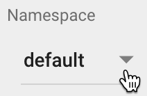
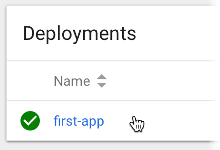

# Day One - Deploying an Application

---

It's time to deploy our first application.

---

## Application

In this repository there is a simple application that can be found inside the `first-app` directory.  Contained within are the files needed to build a _Docker_ image and run it on _Kubernetes_.

```console
/first-app/
  Dockerfile          # The Dockerfile to build the application
  html/
    index.html        # A simple web page
  kubernetes/         # Kubernetes manifests to deploy the application
    deployment.yaml
    service.yaml
```

If you look at the `Dockerfile` you will see that it is very basic.  Using an _Alpine_ version of _Nginx_ to serve a single page of static content.

```dockerfile
FROM nginx:1.15.0-alpine
COPY html/ /usr/share/nginx/html/
```

So the first thing we need to do is build the _Docker_ image.  As described previously, it is possible to use the _Minikube_ version of the _Docker_ daemon for development.  So let's go ahead and build the image.

```console
cd first-app
eval `minikube docker-env`
docker build -t first-app:v1 .
```

As the image is being built with the _Minikube_ _Docker_ daemon it will be available for _Kubernetes_ to run.  We can test the image locally before using it inside _Kubernetes_.

```console
docker run -d -p 8000:80 first-app:v1
curl `minikube ip`:8000
```

```console
<html>

<head>
    <title>Kubernetes in 7 Days</title>
</head>

<body>
    <h1>Kubernetes in 7 Days</h1>
    <h2>First Application</h2>
</body>

</html>
```

Now, let's look at the _Kubernetes_ manifests.

The `deployment.yaml` manifest describes to _Kubernetes_ how to run the _Docker_ container inside a _Pod_.  _Pods_ are covered in more detail in [_Day Two - Hello Kubernetes with Minikube_](../02-hello-kubernetes-with-minikube/02-01.md).

```yaml
apiVersion: apps/v1 
kind: Deployment
metadata:
  name: first-app
spec:
  selector:
    matchLabels:
      app: first-app
  replicas: 2
  template:
    metadata:
      labels:
        app: first-app
    spec:
      containers:
      - name: first-app
        image: first-app:v1
        ports:
        - containerPort: 80
```

The `service.yaml` manifest describes to _Kubernetes_ how to make the _Pods_ available on the network by using a _Service_ resource type.  Once again _Services_ are covered in more detail in [_Day Two - Hello Kubernetes with Minikube_](../02-hello-kubernetes-with-minikube/02-01.md).

```yaml
kind: Service
apiVersion: v1
metadata:
  name: first-app
spec:
  selector:
    app: first-app
  type: NodePort
  ports:
  - protocol: TCP
    port: 80
    targetPort: 80
```

Ok, lets deploy our application to _Minikube_.

```console
kubectl -n default create -f kubernetes
```

```console
deployment.apps "first-app" created
service "first-app" created
```

We've just deployed our first application!  So let's have a look at what is running in _Kubernetes_.

```console
kubectl -n default get pod
```

```console
NAME                         READY     STATUS    RESTARTS   AGE
first-app-6d6ff585bc-4mx5k   1/1       Running   0          1m
first-app-6d6ff585bc-w6k4r   1/1       Running   0          1m
```

We can see that we have 2 _Pods_ running.  This is because we asked for 2 `replicas` inside the `deployment.yaml`.

```yaml
...
  replicas: 2
...
```

And the _Service_.

```console
kubectl -n default get service
```

```console
NAME         TYPE        CLUSTER-IP      EXTERNAL-IP   PORT(S)        AGE
first-app    NodePort    10.105.113.13   <none>        80:30540/TCP   4m
```

In the `service.yaml` we asked for a _Service_ type called _NodePort_.  This makes the mapped container port directly available on the _Kubernetes_ node.  In this case, port `80` of the container has been mapped to port `30450` of the _Minikube_ VM.

So, let's test that we can access the application running inside _Minikube_.

```console
curl `minikube service -n default first-app --url`
```

```console
<html>

<head>
    <title>Kubernetes in 7 Days</title>
</head>

<body>
    <h1>Kubernetes in 7 Days</h1>
    <h2>First Application</h2>
</body>

</html>
```

Finally, let's use the dashboard you see the _Deployment_.

```console
minikube dashboard
```

Make sure that you are looking at the `default` namespace.



Click on _Deployments_.


And you should see the `first-app` deployment.




# Next

It's time for some homework.

[Next](01-06.md)