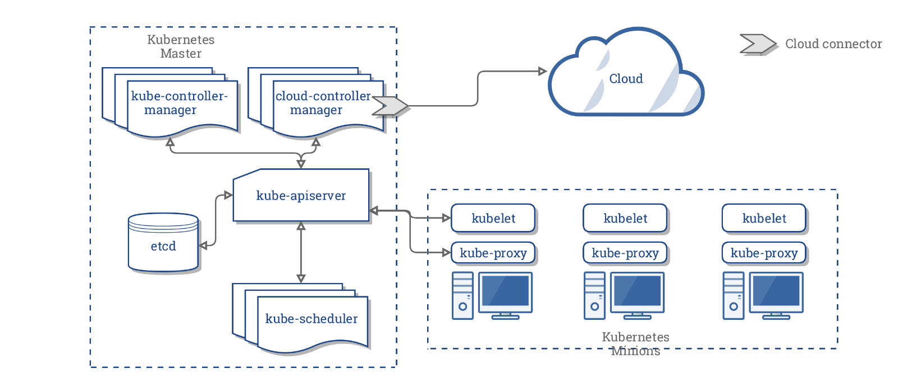
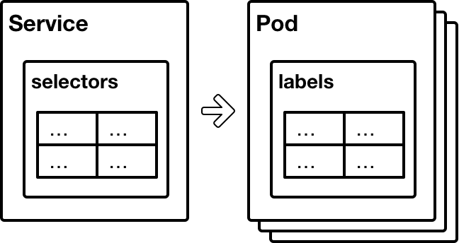
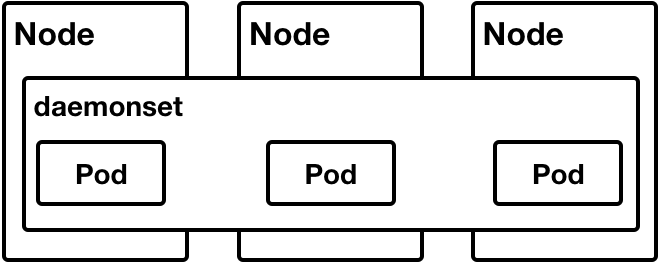
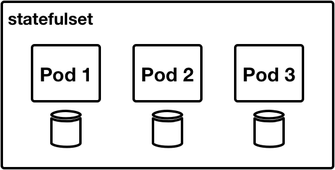
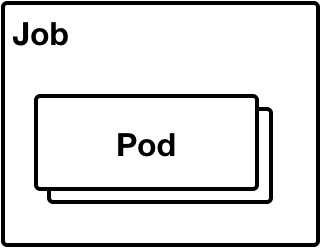
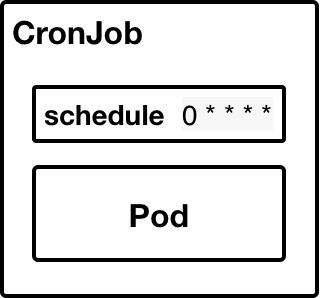
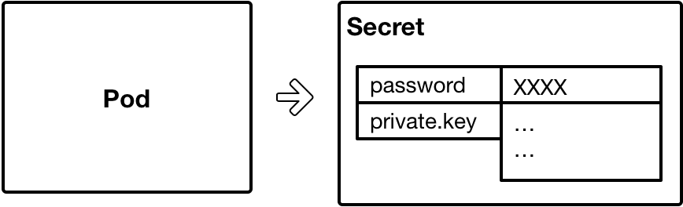
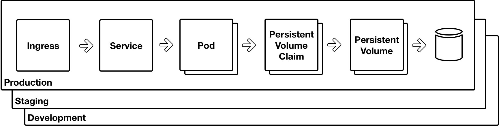

# Day Two - Kubernetes Architecture

---

In this section we will do a quick whistle stop tour of _Kubernetes_ architecture.

---

## Kubernetes Processes

There is a core set of _Kubernetes_ processes that form the cluster runtime.  The cluster runtime is further divded into master components, aka the control plane, and node components.  There is also a set of cluster add-ons.

A diagram of the cluster can be seen below.  Note, that the old name of _Kubernetes Minions_ is used in the diagram.  Now they are known as _Kubernetes Nodes_.

[Diagram Source](https://kubernetes.io/docs/concepts/architecture/cloud-controller/)

More information about the _Kubernetes_ processes can be found [here](https://kubernetes.io/docs/concepts/overview/components/).

### Master Components

#### kube-apiserver

The `kube-apiserver` exposes the _Kubernetes_ API.  It is where the _Kubernetes Resources_ are published into.

#### kube-controller-manager

The `kube-controller-manager` runs a number of controllers that are responsible for watching for particular _Kubernetes Resources_ in the API.  The controllers bring the cluster into alignment with the declared state in the _Resources_.

#### kube-scheduler

The `kube-scheduler` assigns _Pods_ to nodes based on a number of criteria.  Such as resource requests and resource availability, workload placement policies, etc.

#### cloud-controller-manager

The `cloud-controller-manager` runs controllers that interact with a specific cloud provider.  An example would be _AWS_ or _Digital Ocean_.

#### Etcd

_Etcd_ is a distributed key / value store.  It is used to store the _Kubernetes_ cluster state.

### Node Components

#### kubelet

The `kubelet` runs on each node and is responsible for managing the _Pods_ on that node.

#### kube-proxy

The `kube-proxy` configures the network rules so that abstractions like the _Service Resource_ work.  _Services_ are described in some detail further on in thid document.

## Kubernetes Concepts

Before describing _Kubernetes Resources_ there is some important conceptual information to cover.

### Labels and Selectors

Labels is one of the fundamental _Kubernetes_ concepts.  A label is a key / value pair that is attached to a _Kubernetes Resource_.  And each _Kubernetes Resource_ can have many labels.  Labels serve as a means to identify a particular _Resource_ or set of _Resources_.  

Selectors are also key / value pairs.  They are used to select _Resources_ that have a particular label or set of labels.  By this mechanism it is possible for one _Resource_ type to select one or more _Resources_ of another type.  Labels can also be used with `kubectl` to query just particular _Resources_.  

The following diagram depicts this selection mechanism with a _Service_ selecting a set of _Pods_. 

More information about labels and selectors can be found [here](https://kubernetes.io/docs/concepts/overview/working-with-objects/labels/).

## Kubernetes Resources

_Resources_ are high level abstractions that contain the declarative state for an infrastructure component.  _Resources_ are published into the _Kubernetes_ API server and it is the responsibility of _Kubernetes_ controllers to bring the cluster into agreement with the declared state.  

There are many different types of _Resource_ available.  The full list of _Resources_ can be found in the [API documentation](https://kubernetes.io/docs/reference/generated/kubernetes-api/v1.10/).  The following sections describe just a few of the most important _Resources_.

**Note**

This is really just a high level introduction.  More detailed information about some of these _Resources_ will be provided as the course unfolds.

### Workloads

#### Pods

As described previously, a [_Pod_](https://kubernetes.io/docs/concepts/workloads/pods/pod-overview/) is the fundamental unit of execution in _Kubernetes_.  A _Pod_ has one or more containers.  The following diagram depicts a _Pod_ and the three types of containers that it can have.

| Container Type    | Description                   |
|:------------------|:------------------------------|
| **Application** | This is the core container for an application.  You must have one of these with the most common pattern being that a _Pod_ only has the application container. |
| **Sidecar** | A _Pod_ can also have other containers that perform some useful work in support of the application container.  A container that ships application logs is a good example. There can be any number of these within a _Pod_. |
| **Init** | Sometimes it is necessary to do some initialisation before starting the application container.  For instance, to create a database.  There can be any number of these _Init_ containers within a _Pod_ and they are run one at a time in sequential order.  See [here](https://kubernetes.io/docs/concepts/workloads/pods/init-containers/) for more information. |

As with other _Resource_ types, a _Pod_ can have labels.  And these labels are used by other _Resources_ (see next section) to enable management of the _Pods_.

#### Deployments

A _Deployment_ allows you to manage the lifecycle of _Pods_ and an associated _Resource_ called a _ReplicaSet_.  

A _Deployment_ contains a specification for a _Pod_ and also additional information, such as the number of _Pods_ to run.  

The _ReplicaSet_ is created when a _Deployment_ is created or updated and it is actually the _ReplicaSet_ that is used as the definition for creating the _Pods_.  

Each time the _Deployment_ is updated a new _ReplicaSet_ is created.  This makes it possible to roll back a _Deployment_ by using the previous _ReplicaSet_.

The following diagram depicts this.

More informations about _Deployments_ can be found [here](https://kubernetes.io/docs/concepts/workloads/controllers/deployment/).

#### DaemonSet

A _Daemonset_ ensures that a _Pod_ is run on all, or a subset, of the available _Kubernetes Nodes_.  

A use case for this might be where you want to have a metric collector run on all the _Nodes_ so that kernel performance statistics can be gathered.

The following diagram depicts this.

More information about _DaemonSets_ can be found [here](https://kubernetes.io/docs/concepts/workloads/controllers/daemonset/).

#### StatefulSet

A _StatefulSet_ manages sets of _Pods_ in a way that provides a guaranteed _Pod_ name and a specific storage volume for each.  The order in which the _Pods_ are created and destroyed is also guaranteed.  

A use case for this is where a distributed database cluster relies upon its members having a specific name with associated data and that the cluster must be created with an initial bootstrap member.  _ElasticSearch_ is a good example of this.

The following diagram depicts this.

More information about _StatefulSets_ can be found [here](https://kubernetes.io/docs/concepts/workloads/controllers/statefulset/).

#### Job

A _Job_ creates one of more _Pods_ and ensures that at least a certain amount of them run to completion.  

A use case for this is a batch data load.

The following diagram depicts this.

More information about _Jobs_ can be found [here](https://kubernetes.io/docs/concepts/workloads/controllers/jobs-run-to-completion/).

#### CronJob

A _CronJob_ runs _Jobs_ on a schedule.  The format for the schedule is the [Cron](https://en.wikipedia.org/wiki/Cron) format.

A use case for this is a scheduled backup.

The following diagram depicts this.

More information about _CronJobs_ can be found [here](https://kubernetes.io/docs/concepts/workloads/controllers/cron-jobs/).

### Discovery and Load Balancing

#### Service

A _Service_ is used to group together one or more _Pods_ using a selector.  The _Service_ then provides a _ClusterIP_ and a DNS name for the _Pods_.  
The _Kube Proxy_ process uses the information contained within a _Service_ to configure appropriate `iptables` rules on each of the nodes so that clients of the _Service_ are able to be routed to an appropriate _Pod_.  

There is a lot more detail to _Services_ which can be found in the link below the diagram.

More information about _Services_ can be found [here](https://kubernetes.io/docs/concepts/services-networking/service/).

#### Ingress

An _Ingress_ is used to configure an _Ingress Controller_ so that a _Service_ can be made accessible externally of the cluster.  

An _Ingress_ is a layer 7 HTTP construct and can configure both HTTP and HTTPS access.  

An _Ingress Controller_ is a reverse proxy that watches for _Ingress Rosources_ in the _Kubernetes_ API server and configures itself with appropriate rules as per the _Ingress_.

The following diagram depicts this.

More information about _Ingresses_ can be found [here](https://kubernetes.io/docs/concepts/services-networking/ingress/).

### Config and Storage

#### ConfigMap

A _ConfigMap_ allows configuration files to be stored independantly of a container image.  The files stored within the _ConfigMap_ can then be mounted into a container within a _Pod_ at runtime.

The following diagram depicts this.

More information about _ConfigMaps_ can be found [here](https://kubernetes.io/docs/tasks/configure-pod-container/configure-pod-configmap/).

#### Secret

A _Secret_ allows secret files and values to be stored independant of a container image.  Much like a _ConfigMap_ but also with the ability to store the value of a key in an environment variable.

The following diagram depicts this.

More information about _Secrets_ can be found [here](https://kubernetes.io/docs/concepts/configuration/secret/).

#### PersistentVolume and PersistentVolumeClaim

A _PersistentVolume_ represents some form of distributed storage.

A _PersistenVolumeClaim_ allows a _PersistentVolume_ to be claimed for a _Pod_.

The following diagram depicts this.

More information about _PersistentVolumes_ and _PersistentVolumeClaims_ can be found [here](https://kubernetes.io/docs/concepts/storage/persistent-volumes/).

### NameSpace

This is where we put it all together.  A _NameSpace_ can be thought of as like an environment.  Collections of _Resources_ can be deployed into the _NameSpace_ to form a grouping of related components.  

Examples of _NameSpace_ use might be to create a DEV environment, or to share a set of services that are used by other _NameSpaces_, i.e. an _Ingress Controller_.

The following diagram depicts this.

More information about _NameSpaces_ can be found [here](https://kubernetes.io/docs/concepts/overview/working-with-objects/namespaces/).

# Next

We've covered a large amount of detail in this section.  And it was only very high level!  

Next up, we will explore the manifests that create the _Resources_.

[Next](02-03.md)