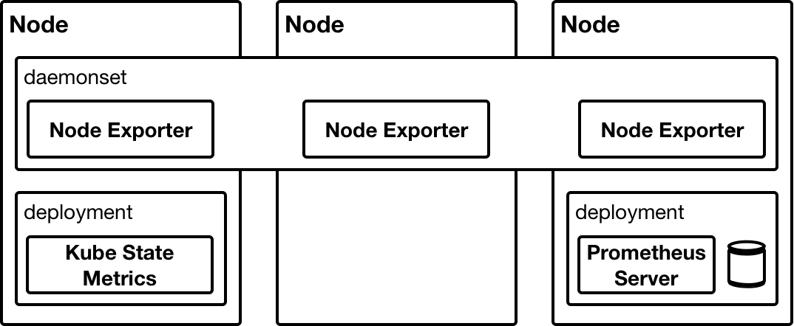
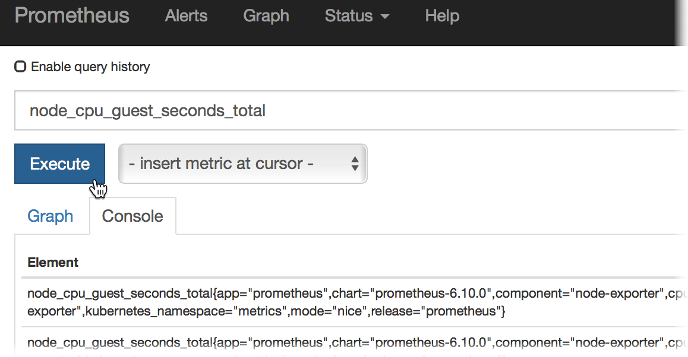
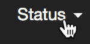

# Day Four - Prometheus

---

In this section we will will deploy [_Prometheus_](https://prometheus.io) into our cluster.  _Prometheus_ is a monitoring solution that collects metrics from endpoints and stores them in its time series database.  _Prometheus_ integrates well with _Kubernetes_ service discovery and is able to collect metrics from dynamically created endpoints without the need to constantly change its configuration.  

Something that distinguishes _Prometheus_ from other, more traditional, monitoring solutions is that it actively goes out and fetches, aka scrapes, the metrics from the endpoints that it is monitoring.  This is in contrast to the usual approach, where the monitored endpoint pushes the metrics to the server.  This approach has the benefit of allowing _Prometheus_ to scale efficiently.

---


## Overview

_Prometheus_ has a number of components.  The primary component being the _Prometheus Server_.  The _Server_ is responsible for both collecting the metrics and storing them.  Then there is the _Pushgateway_.  The _Pushgateway_ is somewhere that a short-lived job can push its metrics to before terminating.  This way its metrics can still be collected by the _Prometheus Server_ even though it no longer exists.  Finally, there is the _Alertmanager_.  This, as its name would suggest, is responsible for raising alerts based on _Prometheus_ queries.

Additional to the _core_ components of _Prometheus_ are the _Exporters_.  The _Exporters_ make available for collection the metrics from many different types of infrastructure component.  For example, the _Node Exporter_ makes available the metrics from a node.  This includes the CPU, memory, disk and NW counters.

The following diagram, taken from the _Prometheus_ [website](https://prometheus.io/docs/introduction/overview/), provides an architectural overview of the _Prometheus_ components.


## Install

To install _Prometheus_ we will use a [_Helm Chart_](https://github.com/kubernetes/charts/tree/master/stable/prometheus) from the `stable` repository.  We will also make use of a `values.yaml` file to override the default values when deploying the _Chart_.

The following diagram shows the _Prometheus_ components that will be installed.



| Component      | Description                                      |
|:---------------|:-------------------------------------------------|
| Prometheus Server  | The Prometheus time series database (TSDB) and collector. |
| Node Exporter      | Makes node level metrics available for scraping. |
| Kube State Metrics | Makes Kubernetes metrics available for scraping. |

The `values.yaml` file that is used to customise the installation of _Prometheus_ is shown below.

```yaml
---
rbac:
  create: true

alertmanager:
  enabled: false

pushgateway:
  enabled: false

server:
  ingress:
    enabled: true
    hosts:
      - prometheus.192.168.26.11.nip.io
    annotations:
      kubernetes.io/ingress.class: nginx
  
  persistentVolume:
    enabled: false
```

This `values.yaml` file ensures that the _Alertmanager_ and _Pushgateway_ components are not installed.  It also creates an _Ingress_ resource so that we can access the _Prometheus_ server using the _Ingress Controller_ we deployed in [_Day Three - Deploy Initial Workloads_](../03-building-a-complex-cluster/03-04.md).  RBAC resources (discussed in [_Day Six_](../06-security-and-access-control/06-01.md)) are also created.  And finally, persistence is turned off.  We talk about persistence in [_Day Five_](../05-persistence-and-databases/05-01.md).

So, let's go ahead and install _Prometheus_.

```console
helm upgrade --install prometheus \
  --namespace metrics \
  -f charts-values/prometheus/values.yaml \
  --version 6.10.0 \
  stable/prometheus
```

We can see the _Kubernetes_ workloads that have been deployed with the following command.

```console
kubectl get deployment,daemonset
```

```console
NAME                                                  DESIRED   CURRENT   UP-TO-DATE   AVAILABLE   AGE
deployment.extensions/prometheus-kube-state-metrics   1         1         1            1           1h
deployment.extensions/prometheus-server               1         1         1            1           1h

NAME                                            DESIRED   CURRENT   READY     UP-TO-DATE   AVAILABLE   NODE SELECTOR   AGE
daemonset.extensions/prometheus-node-exporter   3         3         3         3            3           <none>          1h
```


## Explore

We can now explore the _Prometheus_ server web UI using the FQDN we provided in the `values.yaml` file.

[http://prometheus.192.168.26.11.nip.io](http://prometheus.192.168.26.11.nip.io)

If we enter a CPU metric in the text box we can check that _Promtheus_ is scraping metrics from the _Node Exporters_.



We can check the status of all the endpoints that _Prometheus_ is scraping from by clicking on the _Status_ link in the top navigation bar.




What we have done in this section is describe the components of _Prometheus_, install _Prometheus_ and then explore it.


# Next

In the next section we will look at _Grafana_.

[Next](04-04.md)
