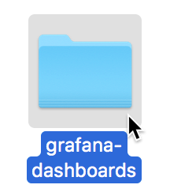
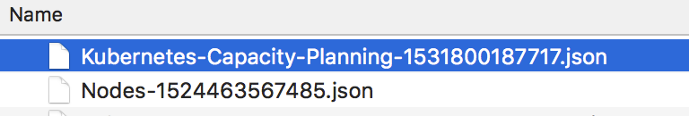
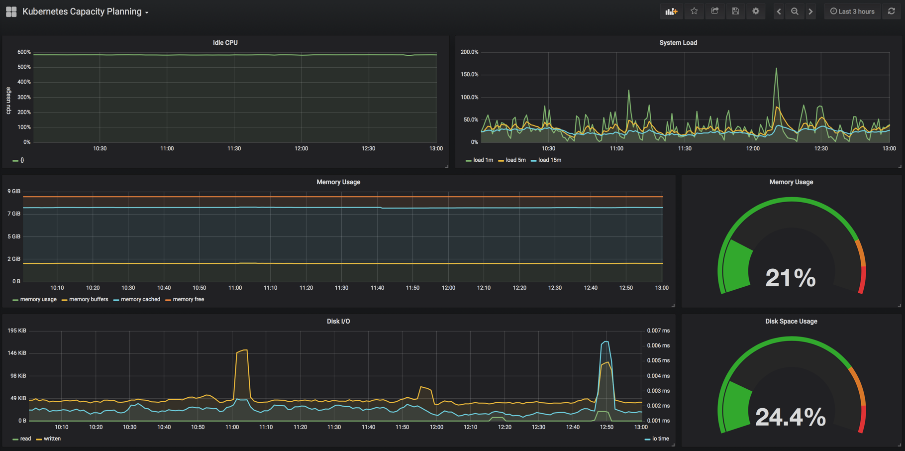

# Day Four - Grafana Dashboards

---

In this section we will install a set of _Grafana_ dashboards to provde us insight into our cluster.

---

## Overview

On the _Grafana_ website is a section that allows you to search for already created dashboards.  It can be found [here](https://grafana.com/dashboards).  If you search for _Kubernetes_ you will find that there is already a lot of dashboards available.  These dashboards can be easily installed into _Grafana_.  But rather than having to figure out which dashboards are useful we will install a set of dashboards that are available in this repository.

## Install

To import the _Grafana_ dashboards we need to first login to _Grafana_.

[http://grafana.192.168.26.11.nip.io](http://grafana.192.168.26.11.nip.io)

Then we click on the _Home_ link in the navigation bar at the top of the page.

From here we can click on _Import dashboard_ on the right side of the drop down.

We are then taken to the _Import_ page.  Now we click on the _Upload .json File_ button.

In the file dialog we navigate to the _grafana-dashboards_ directory in this repository.

And let's start by importing the `Kubernetes-Capacity-Planning-1531800187717.json` dashboard.

You will be brought back to the _Import_ page.  In the _Options_ section click on the _prometheus_ field and select _prometheus_.

Finally, click on the _Import_ button..

You will then be shown the _Kubernetes Capacity Planning_ dashboard.

You now have your first working _Grafana_ dashboard.

As you will have seen, there are many other dashboards inside the `grafana-dashboards` directory.  So go ahead and install them all using the same method you used for the _Kubernetes Capacity Planning_ dashboard.

## Explore

Now that you have installed all the dashboards you should have the following set available in _Grafana_.

* Kubernetes Capacity Planning
* Kubernetes Control Plane Status
* Kubernetes Deployments
* Kubernetes StatefulSets
* Kubernetes Pods
* Kubernetes Resource Requests
* Nodes
* System

Go ahead and explore them.

What we have done in this section is describe where you can find pre-made _Grafana_ dashbaords and then we installed a set of useful dashboards.

# Next

Now it's time to do some homework.

[Next](04-06.md)
