# Day Six - Keycloak

---

In this section we are going to deploy [_Keycloak_](https://www.keycloak.org) into our cluster.  _Keycloak_ is an open source identity and access management server that we will use to store and authenticate users.  Once we have installed _Keycloak_ we will configure it so that it is ready to help us protect our cluster.  

---


## Install

To install _Keycloak_ we will use a [_Helm Chart_](https://github.com/helm/charts/tree/master/stable/keycloak) from the `stable` repository.  We will also make use of a `values.yaml` file to override the default values when deploying the _Chart_.

But, before we install _Keycloak_ we will need to create a certficate to protect it using TLS.  We will use a project called _onessl_ to create our root CA and server certificates.

So, let's install _onessl_.

```console
curl -L -o onessl https://github.com/kubepack/onessl/releases/download/0.7.0/onessl-darwin-amd64; \
  chmod +x onessl; \
  sudo mv onessl /usr/local/bin
```

And, now let's create our certificates.

```console
mkdir ~/tmp/onessl
cd ~/tmp/onessl

# Create a root CA and server certificate and key
onessl create ca-cert
onessl create server-cert --domains keycloak.192.168.26.11.nip.io --ips 192.168.26.11
```

Now that we have our certificates we need to create a _Kubernetes_ TLS _Secret_ that will be used by the _Keycloak_ _Ingress_ resource.

```console
kubectl create ns keycloak
kubectl -n keycloak create secret tls keycloak-tls --cert server.crt --key server.key
```

The values.yaml file that will be used to customise the installation of _Keycloak_ is shown below.

```yaml
---
keycloak:
  ingress:
    enabled: true
    hosts:
      - keycloak.192.168.26.11.nip.io
    annotations:
      kubernetes.io/ingress.class: nginx
    tls:
      - secretName: keycloak-tls
        hosts:
          - keycloak.192.168.26.11.nip.io

  persistence:
    deployPostgres: true
    dbVendor: postgres
    dbPassword: changeme

postgresql:
  persistence:
    enabled: true
    storageClass: rook-ceph-block
    size: 2Gi
  postgresPassword: changeme
```

Ok, we're now ready to install _Keycloak_.

```console
helm upgrade --install keycloak \
  --namespace keycloak \
  -f charts-values/keycloak/values.yaml \
  --version 3.1.0 \
  stable/keycloak
```


## Configure

Before we can access the _Keycloak_ web UI we will need to trust the root CA certificate that we used to sign the server certificate used by the _Ingress_.  The following steps show how we can trust this certificate.

Navigate to the `~/tmp/onessl/` directory and double click on the `ca.crt` file.


A dialog will then appear that asks us if we want to add the certificate to a keychain.  Select to add it to the _System_ keychain.

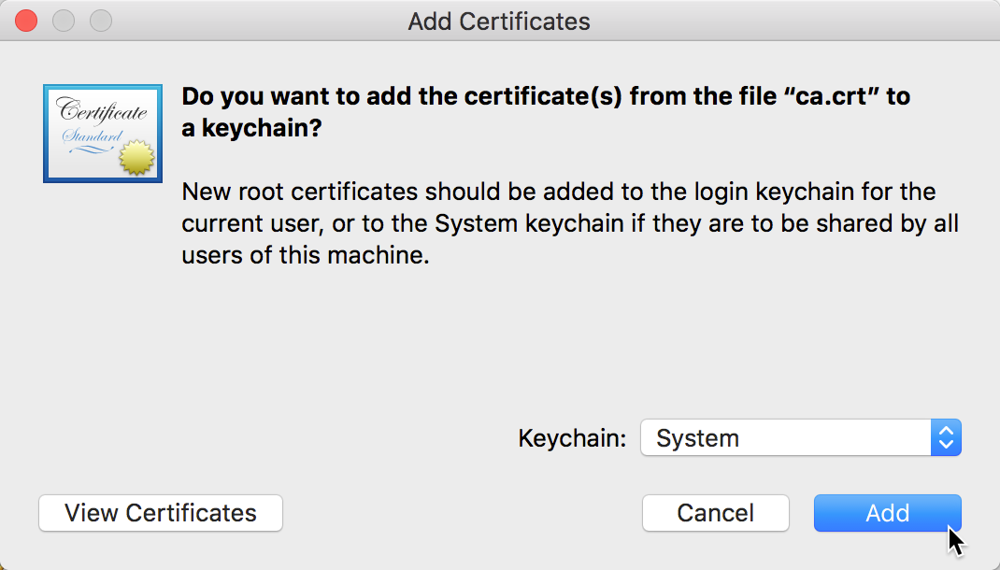

Even though the certificate has been added it is still not trusted, as can bee seen by the red cross icon. 

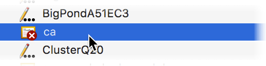

Double click on the certificate and in the dialog that appears select to _Always Trust_ the certificate.

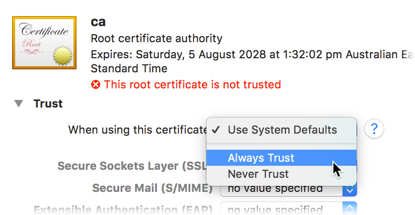

You will now see a blue cross icon next to the certificate.

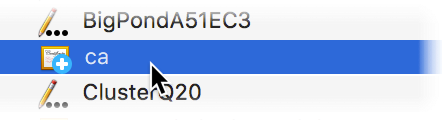

Now we can login to _Keycloak_.  But first we will need to get the password for the `keycloak` user.  The following command shows how.

```console
kubectl get secret --namespace keycloak keycloak-http -o jsonpath="{.data.password}" | base64 --decode; echo
```

So, let's login to _Keycloak_.

[https://keycloak.192.168.26.11.nip.io](https://keycloak.192.168.26.11.nip.io)

Click on the _Administration Console_ link.

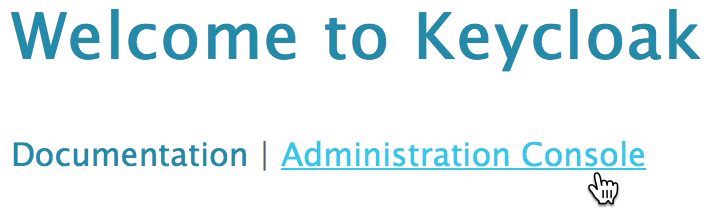

On the login form use the username `keycloak` and the password that you got from the `kubectl` command.

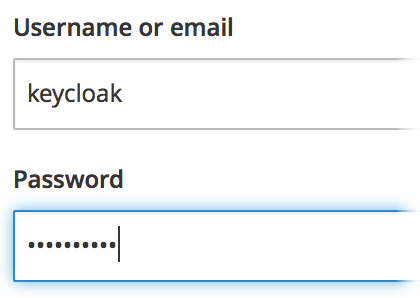

You will now be presented with the _Keycloak_ administration interface.  Move your pointer over the _Master_ name in the top of the left hand navigation pane.  A button to _Add realm_ will appear.  Click on the button.

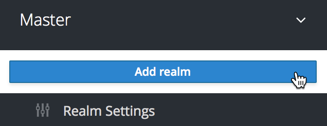

Add _kube7days_ the the _Name_ field and click on the _Create_ button.

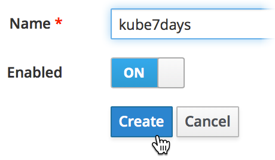

Now, click on the _Clients_ link in the left hand navigation pane.

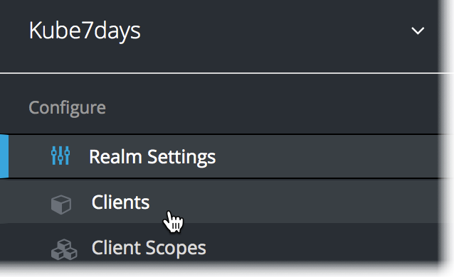

Click on the _Create_ button.

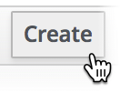

Add _kubernetes_ to the _Client ID_ field and click on the _Save_ button.

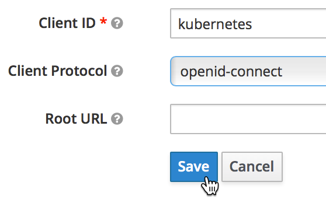


Select _confidential_ from the _Access Type_ drop down list field.


Add the following values the the _Valid Redirect URIs_ field.

* `http://127.0.0.1:5555/callback`
* `https://dashboard.192.168.26.11.nip.io/oauth/callback`

And click on the _Save_ button.

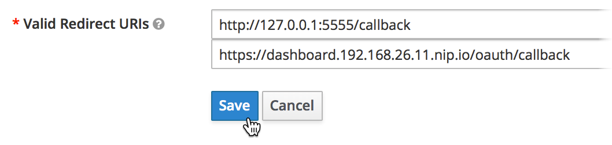

Now, click on the _Credentials_ tab and make a note of the _Secret_, we will need it later.

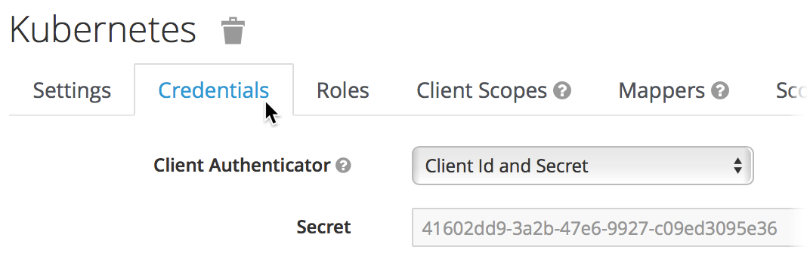

Next, click on the _Mappers_ tab.

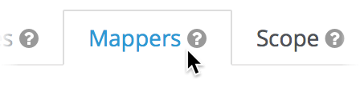

Click on the _Create_ button.


Select _Group Membership_ from the _Mapper Type_ drop down list field and add _groups_ to both the _Name_ and _Token Claim Name_ fields.  Then click on the _Save_ button.

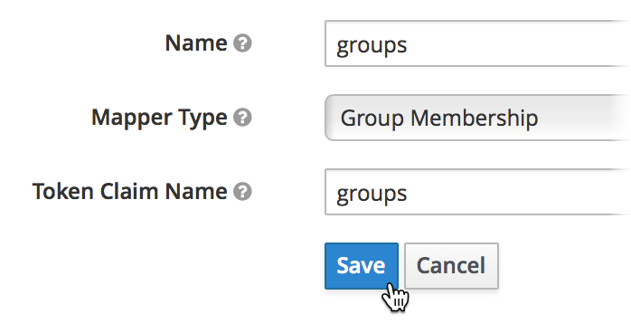

Click on the _Mappers_ link on the bread-crumbs navigation element.

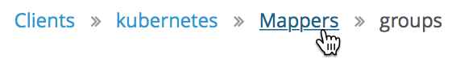

Click on the _Add Builtin_ button.

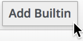

Click on the tickbox for each of the _full name_, _email_ and _username_ fields.  Then click on the _Add selected_ button.

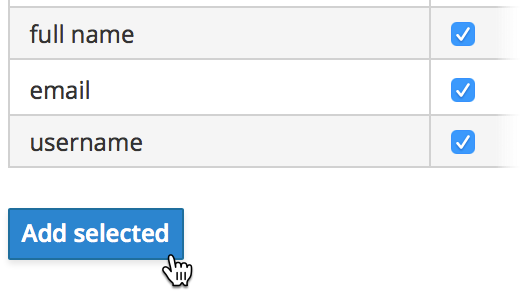

Now we want to add a group and user so that we are able to restrict access to our _Kubernetes_ cluster in the next sections.

Click on _Groups_ in the left hand navigation pane.

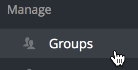

Click on the _New_ button.

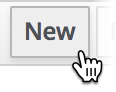

Add _admin_ to the _Name_ field and click the _Save_ button.

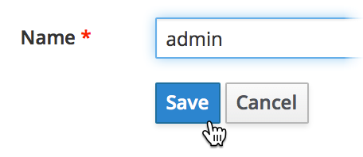

Now, click on _Users_ in the left hand navigation pane.

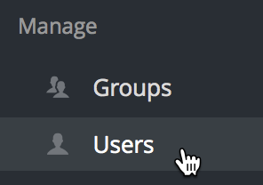

Click on the _Add user_ button.


Add _kube7days_ to the _Username_ field and _kube7days@packt.com_ to the _Email_ field.  Also, click on the _Email Verified_ field so that it shows _ON_.  Finally, click on the _Save_ button.


Click on the _Credentials_ tab.

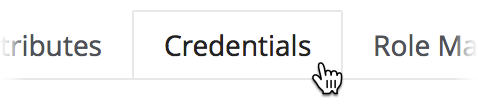

Add a password to the _New Password_ and _Password Confirmation_ fields.  Click on the _Temporary_ field so that it shows _OFF_.  Then click on the _Reset Password_ button.

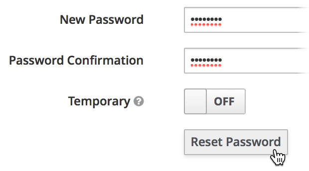

Click on the _Groups_ tab.

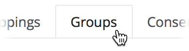

Select the _admin_ group from the _Available Groups_ selection box and click the _Join_ button. 

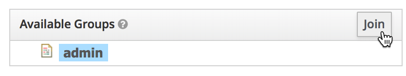

That completes the setup of _Keycloak_.


What we have done in this section is install _Keycloak_ and configure it ready to be used when we lock down access to our _Kubernetes_ cluster.


# Next

In the next section we will configure _Kubernetes_ to use _Keycloak_ through OIDC (Open ID Connect).

[Next](06-04.md)
