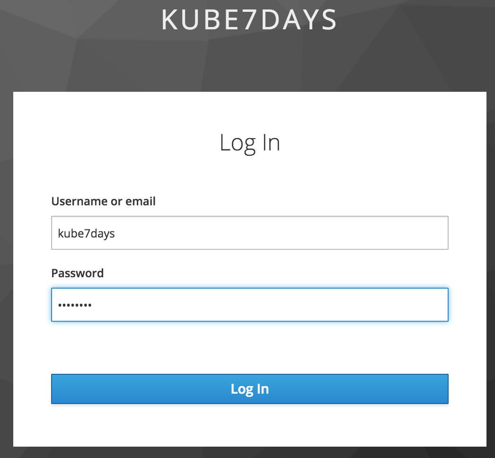

# Day Six - Securing the Kubernetes Dashboard

---

In this section we will extend our _Kubernetes_ dashboard deployment so that it is protected using OpenID.  

---


We already deployed a _Kubernetes_ dashboard [earlier](../03-building-a-complex-cluster/03-04.md) when we deployed some initial workloads.  At the time the only way to access the dashboard was using `kubectl port-forward ...` or `kubectl proxy`.  We will now deploy a set of _Kubernetes_ manifests that will make the dashboard available through an _Ingress_ and also send us to _Keycloak_ to authenticate our credentials.

The _Kubernetes_ manifests that we will deploy are described below.

| Manifest           | Description                 |
|:-------------------|:----------------------------|
| `deployment.yaml`  | This _Deployment_ configures an instance of the [_Keycloak OpenID Proxy_](https://github.com/gambol99/keycloak-proxy) that will add _Keycloak_ into our security path. |
| `service.yaml`     | The _Service_ resource for the _Deployment_. |
| `ingress.yaml`     | The _Ingress_ resource for the _Service_.    |
| `clusterrolebinding.yaml` | A _ClusterRoleBinding_ resource that maps the group `admin` to the _ClusterRole_ `cluster-admin`.  |

But, before we deploy the manifests we will need to create a new server certificate to be used by the _Ingress_ for the _Keycloak OpenID Proxy_.

```console
# Create a new server certificate and key
cd ~/tmp/onessl/
mkdir kubernetes-dashboard
cd kubernetes-dashboard
cp ../ca* .
onessl create server-cert --domains dashboard.192.168.26.11.nip.io --ips 192.168.26.11 --certificate-authority ..

# Create a TLS Secret to hold the server certificate and key
kubectl -n kube-system create secret tls kubernetes-dashboard-tls --cert server.crt --key server.key
```

One final thing we must also do before deploying the manifests is to change the `client-secret` to the value we mae a note of earlier when creating the `kubernetes` client in _Keycloak_.

```console
# This is the location you cloned the Kubernetes in 7 Days repo into
cd ~/Sites/ThirdParty/kubernetes-in-7-days/

vi manifests/kubernetes-dashboard/deployment.yaml
```

Change the folllowing argument to be reflective of your `client-secret`.

```yaml
- --client-secret=41602dd9-3a2b-47e6-9927-c09ed3095e36
```

Now we can deploy our manifests.

```console
# Deploy the manifests
kubectl apply -f manifests/kubernetes-dashboard/
```

We should see that the `kubernetes-dashboard-proxy` _Pod_ starts.

```console
kubectl get pod -l app=kubernetes-dashboard-proxy
```

```console
NAME                                          READY     STATUS    RESTARTS   AGE
kubernetes-dashboard-proxy-6665f9f55f-9bj7l   1/1       Running   0          1m
```

When we added our `kube7days` user in the [previous](06-03.md) section, we made them a member of the `admin` group.  The _ClusterRoleBinding_ we just applied maps the `admin` group to the _ClusterRole_ `cluster-admin`.  This means our `kube7days` user shoukd have the authrorisation to do anything on the cluster.

So, let's test we can access the _Kubernetes_ dashboard.

[https://dashboard.192.168.26.11.nip.io](https://dashboard.192.168.26.11.nip.io)

The first time we try and access the dashboard URL we will be directed to the _Keycloak_ login page for the _kube7days_ realm.  Login using the `kube7days` user with the password you set earlier.



You will now be taken to the _Kubernetes_ dashboard and have full access rights.


What we have done in this section is extend our _Kubernetes_ dashboard deployment so that we can use _Keycloak_ to authenticate users.  We have also created an RBAC rule that gives members of the `admin` group full administrative access to the cluster.


# Next

In the next section we will secure the `kubectl` command.

[Next](06-06.md)
