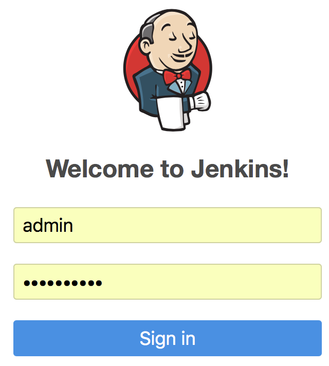
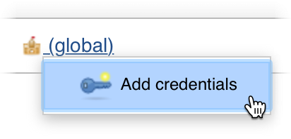
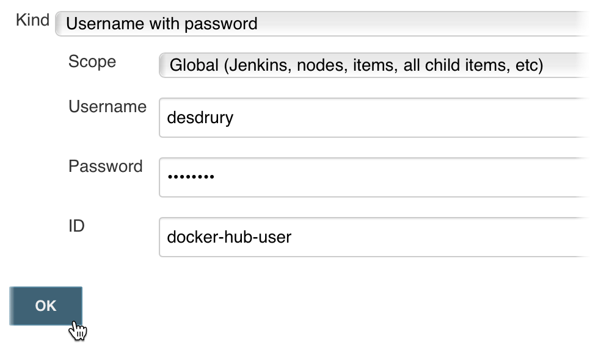

# Day Seven - Jenkins

---

In this section we are going to install [_Jenkins_](https://jenkins.io) into our cluster.  _Jenkins_ is a very popular open source jobs and automation server that is often used for CI/CD.  We will also install a _Docker_ daemon as a _Pod_ so that we can build _Docker_ images.

---


## Install

To install _Jenkins_ we will use a [_Helm Chart_](https://github.com/helm/charts/tree/master/stable/jenkins) from the `stable` repository.  We will also make use of a `values.yaml` file to override the default values when deploying the _Chart_.

The values.yaml file that will be used to customise the installation of _Jenkins_ is shown below.

```yaml
---
rbac:
  install: true

Master:
  Image:    jenkins/jenkins
  ImageTag: 2.136
  ServiceType: ClusterIP
  HostName:    jenkins.192.168.26.11.nip.io

  Ingress:
    Annotations:
      kubernetes.io/ingress.class: nginx

Persistence:
  Enabled: true
  StorageClass: rook-ceph-block
  Size: 2Gi
```

So, let's go ahead and install _Jenkins_.

```console
helm upgrade --install jenkins \
  --namespace jenkins \
  -f charts-values/jenkins/values.yaml \
  --version 0.16.18 \
  stable/jenkins
```


## Configure

Before we can login to _Jenkins_ we will need to get the password for the `admin` user.  The following command shows how.

```console
printf $(kubectl get secret --namespace jenkins jenkins -o jsonpath="{.data.jenkins-admin-password}" | base64 --decode);echo
```

Let's access the _Jenkins_ web UI.

[http://jenkins.192.168.26.11.nip.io/login](http://jenkins.192.168.26.11.nip.io/login)

On the login form use the username `admin` and the password that you got from the previous `kubectl` command.



We will now need to create a _Jenkins Credential_ for our _Docker Hub_ account so that later on when we build the `first-app` using a `Jenkinsfile` we are able to push it.  We don't have to create a _Credential_ for our _GitHub_ user as we will be working with a public fork of the Packt repo for [_Kubernetes in 7 Days_](https://github.com/PacktPublishing/kubernetes-in-7-days-video).

Click on the _Credentials_ link in the left hand navigation pane.


Now, hover the pointer over the __(global)_ link and a small arrow will appear to the right.  Make sure you click with the pointer over the arrow and an _Add credentials_ link will appear.  Click it.



On the following page add your _Docker Hub_ username and password to the _Username_ and _Password_ fields.  Also, add `docker-hub-user` to the _ID_ field.  Then click on the _OK_ button.




## Docker in Docker

For the _Docker_ commands to work in the pipeline we will need a _Docker_ daemon.  Once technique is to use the _Docker_ daemon running on the _Kubernetes_ node.  However, this has the disadvantage of consuming resources in a way that _Kubernetes_ is unaware of.  Therefore _Kubernetes_ may schedule work to a node that does not have sufficient capacity.  It is also a security risk to use the _Docker_ daemon of the _Kubernetes_ node.  

To mitigate against these issues we will deploy a _Docker_ daemon into a _Pod_ in the same _NameSpace_ as our _Jenkins_ server.  A so-called _Docker in Docker_ (DinD) pattern.

So, let's go ahead and deploy our DinD Chart.

```console
helm upgrade --install dind \
  --namespace jenkins \
  charts/dind/
```


What we have done in this section is deploy a _Jenkins_ server.  We have then created _Jenkins Credentials_ for _Docker Hub_.  Finally, we deployed a _Docker in Docker_ _Pod_.


# Next

In the next section we will discuss how _Jenkins_ implements _Pipeline as Code_.

[Next](07-04.md)
