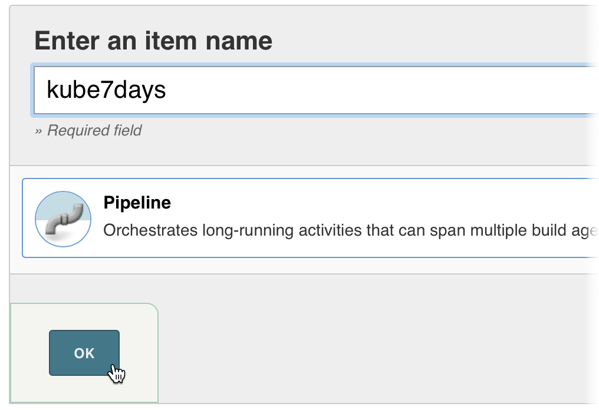

# Day Seven - Create a Pipeline

---

In this section we will ..

---

We won't do a full CI/CD setup as that is too much for this course  But we will implement some of the important aspects.


Fork the repo and modify the Jenkinsfile.

`pipelines/Jenkinsfile.first-app`

Change the following `sh` commands so that your _Docker Hub_ user is used instead of `desdrury`.

```jenkinsfile
...
...
    sh """
      docker build \
        -t desdrury/first-app:${VERSION}.${COMMIT}  \
        -t desdrury/first-app:latest \
        .
    """
...
...
    sh "docker push desdrury/first-app:${VERSION}.${COMMIT}"
    sh 'docker push desdrury/first-app:latest'
...
...
    sh """
      helm upgrade --install first-app \
        --namespace production \
        --set image.repository=desdrury/first-app \
        --set image.tag=${VERSION}.${COMMIT} \
        --set ingress.enabled=true \
        --set ingress.hosts[0]=first-app-cicd.192.168.26.11.nip.io \
        first-app
    """
```

Now we need to create a _Pipeline_ job in _Jenkins_.

Click on the _New Item_ link in the left hand navigation pane.


Enter `kube7days` in the _Enter an item name_ field.  Click on the _Pipeline_ link.  Then click on the _OK_ button.




When we run the pipeline a new _Pod_ will be created with the contaienrs we defined in the `Jenkinsfile`.  As below.

```console
kubectl describe pod jenkins-slave-1mhfr-hhzm1

...
...
Events:
  Type    Reason     Age   From               Message
  ----    ------     ----  ----               -------
  Normal  Scheduled  3m    default-scheduler  Successfully assigned jenkins/jenkins-slave-1mhfr-hhzm1 to node1
  Normal  Pulling    3m    kubelet, node1     pulling image "lachlanevenson/k8s-helm:v2.8.1"
  Normal  Pulled     3m    kubelet, node1     Successfully pulled image "lachlanevenson/k8s-helm:v2.8.1"
  Normal  Created    3m    kubelet, node1     Created container
  Normal  Started    3m    kubelet, node1     Started container
  Normal  Pulling    3m    kubelet, node1     pulling image "docker:17.12.1-ce"
  Normal  Pulled     2m    kubelet, node1     Successfully pulled image "docker:17.12.1-ce"
  Normal  Created    2m    kubelet, node1     Created container
  Normal  Started    2m    kubelet, node1     Started container
  Normal  Pulling    2m    kubelet, node1     pulling image "jenkins/jnlp-slave:alpine"
  Normal  Pulled     1m    kubelet, node1     Successfully pulled image "jenkins/jnlp-slave:alpine"
  Normal  Created    1m    kubelet, node1     Created container
  Normal  Started    1m    kubelet, node1     Started container
```


What we have done in this section is ...


## Scratch

The pipeline for deploying the `first-app`.


# Next

In the next section we will ....

[Next](07-06.md)
